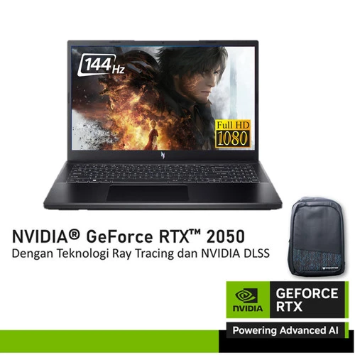
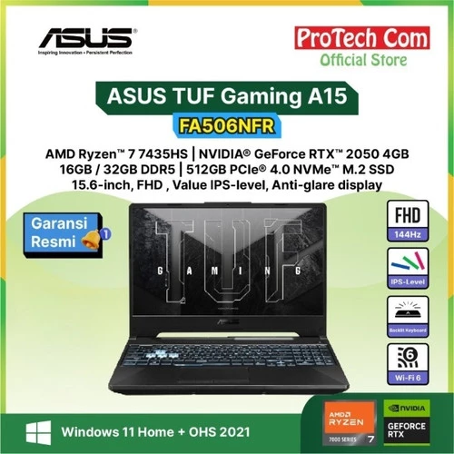
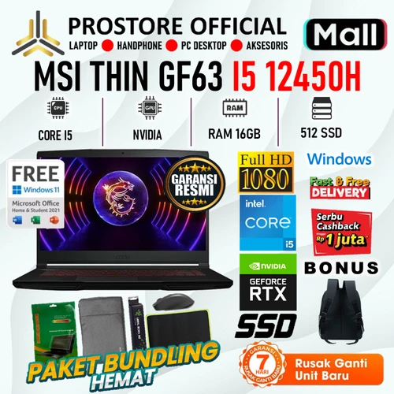
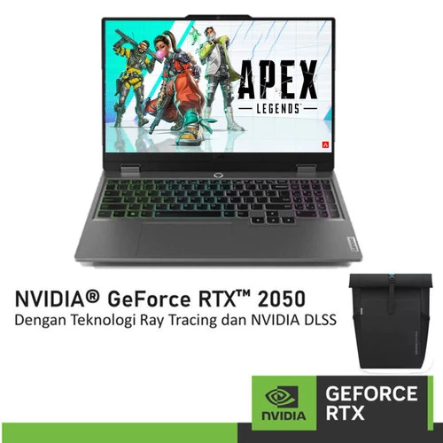
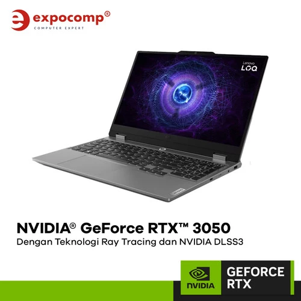

# 💻 Pemakaian Laptop oleh Abang

Dalam penggunaan laptop ke depannya, saya akan fokus pada pemakaian software kreatif untuk keperluan desain. Contohnya:

- **Blender 3D** (desain 3D)
- **Adobe Photoshop** & **Adobe Illustrator** (desain grafis)
- **DaVinci Resolve** (pengeditan video, masih dalam tahap pembelajaran)

Kenapa fokus ke aplikasi kreatif?

Karena abang memiliki minat utama di bidang **Game Development** dan **Game Design**. Selain itu, abang juga aktif dalam komunitas gim dan ikut serta dalam mendesain konten media sosial seperti Instagram dan Facebook.

---

## 💸 Pertimbangan Harga Laptop: Rp 9–10 Jutaan

### ⚠️ Kekurangan

- **Performa GPU terbatas**

  Pada rentang harga ini, umumnya hanya tersedia GPU *entry level* seperti **NVIDIA RTX 2050**, atau bahkan tidak ada GPU sama sekali karena laptop yang tersedia mayoritas adalah laptop kantoran.

- **CPU yang kurang optimal**

  CPU pada laptop harga ini memang cukup kuat untuk tugas dasar, tetapi masih "nanggung" untuk beban kerja berat seperti desain 3D atau game development.

- **Layar kurang akurat untuk desain grafis**

  Desain membutuhkan akurasi warna yang tinggi. Sayangnya, panel layar pada laptop di harga ini sering kali belum mendukung 100% sRGB atau color accuracy yang baik.

### ✅ Kelebihan

- **Harga lebih terjangkau**

  Rentang harga ini cocok untuk pengguna kasual atau mahasiswa dengan kebutuhan ringan.

---

## 💸 Laptop di Atas Rp 11 Jutaan

### ⚠️ Kekurangan

- **Harga lebih mahal**

  Investasi lebih besar diperlukan untuk mendapatkan performa yang memadai.

- **Bobot laptop lebih berat**

  Umumnya laptop dengan GPU kuat adalah **laptop gaming**, yang cenderung berat. Meskipun begitu, ini adalah kompromi yang bisa diterima untuk performa yang jauh lebih baik.

### ✅ Kelebihan

- **Performa GPU jauh lebih baik**

  GPU seperti **RTX 3050** ke atas bisa ditemukan di kisaran harga ini dan menawarkan performa jauh di atas RTX 2050.

- **CPU lebih kencang**

  CPU di kisaran harga ini sudah mendukung beban kerja berat seperti komputasi grafis, rendering, dan development tools.

- **Kemungkinan mendapat layar dengan akurasi warna tinggi**

  Beberapa laptop di harga ini sudah memiliki layar dengan panel IPS dan cakupan sRGB tinggi, cocok untuk desain.

---

## 📷 Rekomendasi Laptop 9 - 10 Jutaan (berdasarkan rekomendasi dari teman)

Acer Nitro V15

[Link Tokopedia](https://tokopedia.link/nukyXAdSDSb)

ASUS TUF Gaming A15

[Link Tokopedia](https://tokopedia.link/RZD9zhiQDSb)

MSI Thin GF63

[Link Tokopedia](https://tokopedia.link/Z8GxuVqQDSb)

Lenovo LOQ 15 RTX 2050

[Link Tokopedia](https://tokopedia.link/8MqcabMQDSb)

## 📷 Rekomendasi Laptop 11 Jutaan (berdasarkan rekomendasi dari teman)

Lenovo LOQ 15 RTX 3050

[Link Tokopedia](https://tokopedia.link/cTdTq2YQDSb)
